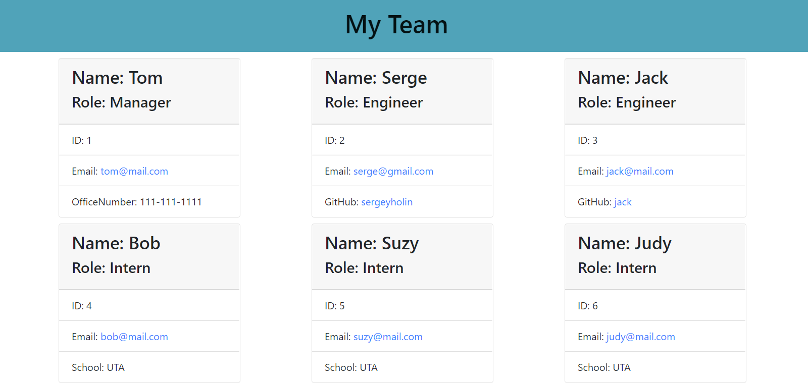

# Team-Profile-Generator
Module 10 Challenge by Sergey Holin

GitHub Repo Link: https://github.com/sergeyholin/Team-Profile-Generator

GitHub Live Deployment Link: https://sergeyholin.github.io/Team-Profile-Generator/

Video Demo Link: https://drive.google.com/file/d/1AcWgmmSY0CcZAlgoFdg5S0cfU_qDa_tB/view

## ABOUT THE APP:

This application allows a user to dynamically generate a HTML page with individual team-employee cards, which are populated by using NODE inquirer module and JS classes and subclasses.

## Acceptance Criteria

```md
GIVEN a command-line application that accepts user input
WHEN I am prompted for my team members and their information
THEN an HTML file is generated that displays a nicely formatted team roster based on user input
WHEN I click on an email address in the HTML
THEN my default email program opens and populates the TO field of the email with the address
WHEN I click on the GitHub username
THEN that GitHub profile opens in a new tab
WHEN I start the application
THEN I am prompted to enter the team manager’s name, employee ID, email address, and office number
WHEN I enter the team manager’s name, employee ID, email address, and office number
THEN I am presented with a menu with the option to add an engineer or an intern or to finish building my team
WHEN I select the engineer option
THEN I am prompted to enter the engineer’s name, ID, email, and GitHub username, and I am taken back to the menu
WHEN I select the intern option
THEN I am prompted to enter the intern’s name, ID, email, and school, and I am taken back to the menu
WHEN I decide to finish building my team
THEN I exit the application, and the HTML is generated
```
## TECHNOLOGIES USED: 

Bootstrap (https://getbootstrap.com/docs/4.0/components/card/)

jQuery (https://jquery.com/)

npm (https://www.npmjs.com/)

NODE.js (modules: fs, inquirer 6.5.0, jest 24.9.0)
(https://nodejs.org/en/)

## SCREENSHOT:

